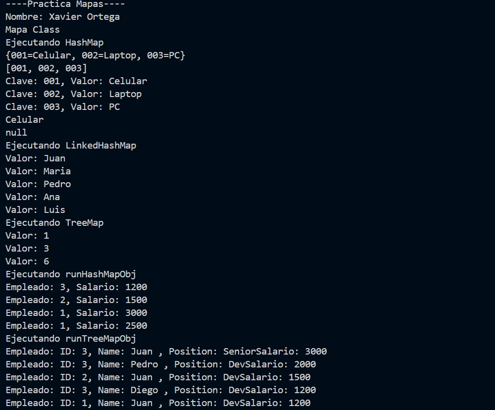
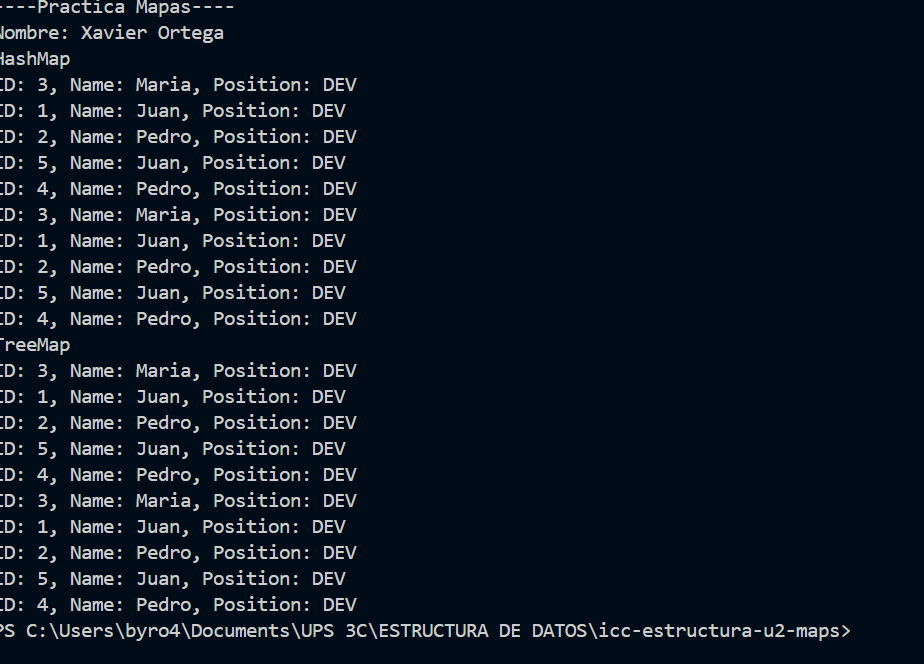
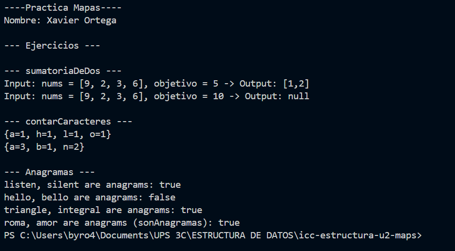

# Non-Linear Data Structures 

## Getting Started

Este repositorio se refiere a la segunda unidad de Estructuras de Datos, donde se cubren estructuras como sets y diccionarios
## Requirements
- Java JDK 11 or higher
- Git 2.20 or higher


## Definición de Maps en Java

Un **Map** en Java es una estructura de datos que almacena pares clave-valor, donde cada clave es única dentro del mapa. Java proporciona varias implementaciones de `Map`, cada una con sus propias características:

1. **`HashMap`**: Basado en una tabla hash, no garantiza orden.
2. **`LinkedHashMap`**: Basado en una tabla hash, pero mantiene el orden de inserción.
3. **`TreeMap`**: Basado en un árbol rojo-negro, mantiene los elementos ordenados según la clave.

### Comparación entre `HashMap`, `LinkedHashMap` y `TreeMap`

| Característica      | `HashMap`          | `LinkedHashMap`      | `TreeMap`           |
|----------------------|-------------------|---------------------|---------------------|
| **Orden**           | No garantizado     | Orden de inserción  | Ordenado por clave según `Comparable` o `Comparator` |
| **Duplicados (Claves)** | No permite         | No permite         | No permite         |
| **Eficiencia (Búsqueda, Inserción, Eliminación)** | O(1) promedio, O(n) peor caso | O(1) promedio, O(n) peor caso | O(log n) |
| **Estructura interna** | Tabla Hash        | Tabla Hash con lista enlazada | Árbol Rojo-Negro |
| **Necesita `equals()` y `hashCode()` en clave** | Sí                 | Sí                 | No, usa `compareTo()` o `Comparator` en la clave |
| **Uso recomendado** | Cuando se necesita rendimiento sin importar el orden | Cuando se necesita rendimiento manteniendo el orden de inserción | Cuando se necesita mantener los elementos ordenados por clave |

**Nota:** Si el `TreeMap` almacena objetos personalizados como clave, se recomienda utilizar un **`Comparator`** para definir el criterio de ordenación en lugar de depender del orden natural del objeto.

---

## Ejemplos de Implementaciones de Map

### Ejemplo con `HashMap`
```java
import java.util.HashMap;
import java.util.Map;

public class HashMapExample {
    public static void main(String[] args) {
        Map<String, Integer> hashMap = new HashMap<>();
        hashMap.put("Juan", 25);
        hashMap.put("Ana", 30);
        hashMap.put("Pedro", 28);
        
        System.out.println("Contenido de HashMap:");
        System.out.println(hashMap);
    }
}
```

### Ejemplo con `LinkedHashMap`
```java
import java.util.LinkedHashMap;
import java.util.Map;

public class LinkedHashMapExample {
    public static void main(String[] args) {
        Map<String, Integer> linkedHashMap = new LinkedHashMap<>();
        linkedHashMap.put("Juan", 25);
        linkedHashMap.put("Ana", 30);
        linkedHashMap.put("Pedro", 28);
        
        System.out.println("Contenido de LinkedHashMap:");
        System.out.println(linkedHashMap);
    }
}
```

### Ejemplo con `TreeMap`
```java
import java.util.Map;
import java.util.TreeMap;

public class TreeMapExample {
    public static void main(String[] args) {
        Map<String, Integer> treeMap = new TreeMap<>();
        treeMap.put("Juan", 25);
        treeMap.put("Ana", 30);
        treeMap.put("Pedro", 28);
        
        System.out.println("Contenido de TreeMap:");
        System.out.println(treeMap);
    }
}
```

---

## Ejercicio

Supón que estás desarrollando una aplicación para administrar un directorio telefónico. Cada entrada en el directorio está compuesta por:
- **nombre completo** (clave, tipo `String`)
- **número de teléfono** (valor, tipo `String`)

El requisito principal es:
1. **No** debe haber nombres duplicados como clave.
2. Es necesario que los contactos estén **ordenados alfabéticamente** por nombre.

**Pregunta**: Entre las distintas implementaciones de `Map` que conoces (`HashMap`, `LinkedHashMap`, `TreeMap`), **¿cuál elegirías para implementar la estructura que almacene los contactos y por qué?**

### Solución recomendada

Usar un **`TreeMap`** porque:
- **Evita duplicados** en claves.
- **Mantiene orden** según la clave (nombre alfabéticamente).
- **Operaciones eficientes**: Inserción, eliminación y búsqueda en **O(log n)** gracias al árbol rojo-negro.

---

## Implementación en Java

### Clase principal con un `TreeMap<String, String>`

```java
import java.util.Map;
import java.util.TreeMap;

public class DirectorioTelefonico {
    public static void main(String[] args) {
        // Creamos un TreeMap para almacenar los contactos ordenados
        Map<String, String> directorio = new TreeMap<>();
        
        // Agregamos algunos contactos
        directorio.put("Pedro López", "123456789");
        directorio.put("Ana Martínez", "987654321");
        directorio.put("Luis Martínez", "111111111");
        directorio.put("Pedro López", "222222222"); // Reemplaza el número anterior
        
        // Imprimimos la agenda ordenada
        System.out.println("Directorio telefónico (ordenado por nombre):");
        for (Map.Entry<String, String> entry : directorio.entrySet()) {
            System.out.println(entry.getKey() + " - " + entry.getValue());
        }
    }
}
```

---

### Consideraciones sobre `hashCode()` y `equals()`

Un `TreeMap` **no usa** `hashCode()` ni `equals()` para determinar la unicidad de claves. En su lugar, usa el `compareTo()` de `Comparable` o el `Comparator` definido.

Si se usara un `HashMap` en lugar de `TreeMap`, entonces `hashCode()` y `equals()` en la clave serían necesarios para evitar colisiones.

---

### Conclusión
Para administrar un directorio telefónico sin claves duplicadas y ordenado por nombre, la mejor solución es un **`TreeMap`**. Esto garantiza orden automático y eficiencia en operaciones de búsqueda y modificación.

## runMapExamlpe()
;


## runEmpleadoExample()



## runEjerccios()

SSS